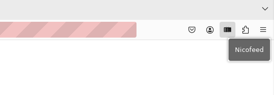
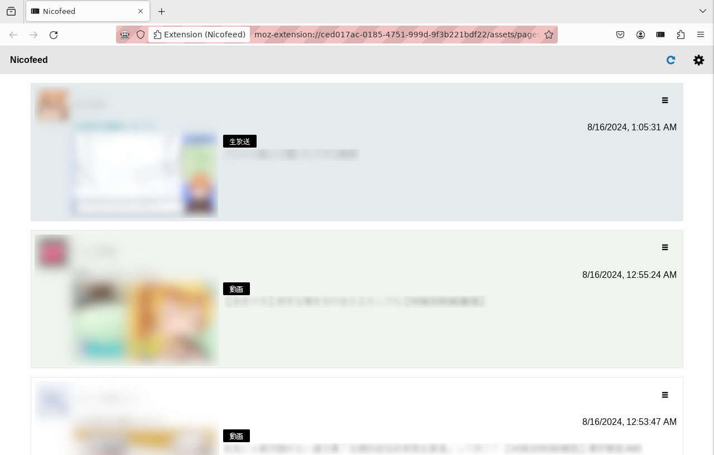

# これは何?

**Nicofeed** は[ニコニコ](https://www.nicovideo.jp/)のフォロー新着を改良する Firefox アドオンです。このアドオンはニコニコのユーザーページを改変しません。その代わりにフォロー新着の情報を独自に取得・表示する特別なページを開くためのボタンをナビゲーションバーに追加します。

## Nicofeed の特長

* スクロール位置の保存

  このアドオンはフォロー新着情報をブラウザの中にローカル保存します。ブラウザを再起動しても状態は失われず、スクロール位置も含めて次回起動時に再現します。

* データの自動取得

  このアドオンは過去のものも含めすべてのフォロー新着情報を自動取得するため、「さらに表示する」ボタンを連打する必要がありません。より新しいフォロー新着情報も自動で取得するため、ページをリロードする必要も無くなります。

* 強化されたフィルタリング機能

  ニコニコの提供するフォロー新着ページでは『コンテンツ投稿』や『動画投稿』などのアクティビティ種別で絞り込んで表示することができますが、それ以上に細かいフィルタリングはできません。Nicofeed のフィルタリング機能を使えば、たとえば次のような設定も可能です。

  * あらゆる投稿者による動画のキリ番再生通知（2,525再生を達成しました等）を非表示し、
  * 特定ユーザーによる生放送の開始通知を非表示し、
  * 特定ユーザーによる静画のクリップを非表示し、
  * それ以外のすべてを表示する。

* 見た目で区別しやすい新着情報種別

  このアドオンは『投稿』『いいね』『マイリス』などの情報の種類ごとに異なる背景色で新着情報を表示します。膨大な広告通知の中に埋もれた新規投稿を見落とす心配はもうありません。

# 使い方

## Nicofeed を開く



アドオンをインストールすると、ブラウザのナビゲーションバーに Nicofeed のアイコンが表示されます。これをクリックすると開きます。

## 画面構成



1. このボタンを押すと新着情報を取得します。押さなくても定期的に取得しますが、これを押すことで任意のタイミングで情報を取得できます。新着情報がある場合には、画面を上方向にスクロールすることでそれを表示できます。
2. メニューを表示します。メニュー内の項目については後述します。
3. 特定のフォロー新着通知を元にフィルタリングルールを作成します。

### メニュー項目

* `フィルタリングルールを編集...`

  作成したフィルタリングルールを削除、または優先順位を変更します。リストの中で上にあるルールほど優先されます。たとえば次の二つのルールがあるとします。

  1. ユーザー A による動画のキリ番到達を表示する
  2. すべてのユーザーによる動画のキリ番到達を非表示にする

  このときルール1はルール2よりも上にあるため、1の方が優先されます。結果としてユーザー A による動画のキリ番到達は表示しますが、それ以外のユーザーによる動画のキリ番到達は非表示になります。

* `設定...`

  アドオンの設定画面を開きます。この画面では新着情報の自動取得間隔などを設定することができます。

* `フォロー新着全体を再取得`

  ブラウザ内に蓄積されたフォロー新着情報を全消去して、サーバーから取得し直します。ユーザーを新たにフォローまたはフォロー解除した時は、既に取得してしまった範囲のデータについてはそのことが反映されないため、この機能を用いて全体を再取得することをお奨めします。

# ビルド方法

```
% npm install
% npm run build
```

これを実行すると `./dist/web-ext-artifacts` ディレクトリ内に未署名の zip アーカイブが作成されるので、それを[一時的にインストール](https://extensionworkshop.com/documentation/develop/temporary-installation-in-firefox/)することができます。また `npm run watch` を実行することでこのアドオンの入った一時的なプロファイルを用いて Firefox を起動することもできます。

# ライセンス

[CC0 1.0 Universal](https://creativecommons.org/share-your-work/public-domain/cc0/)
